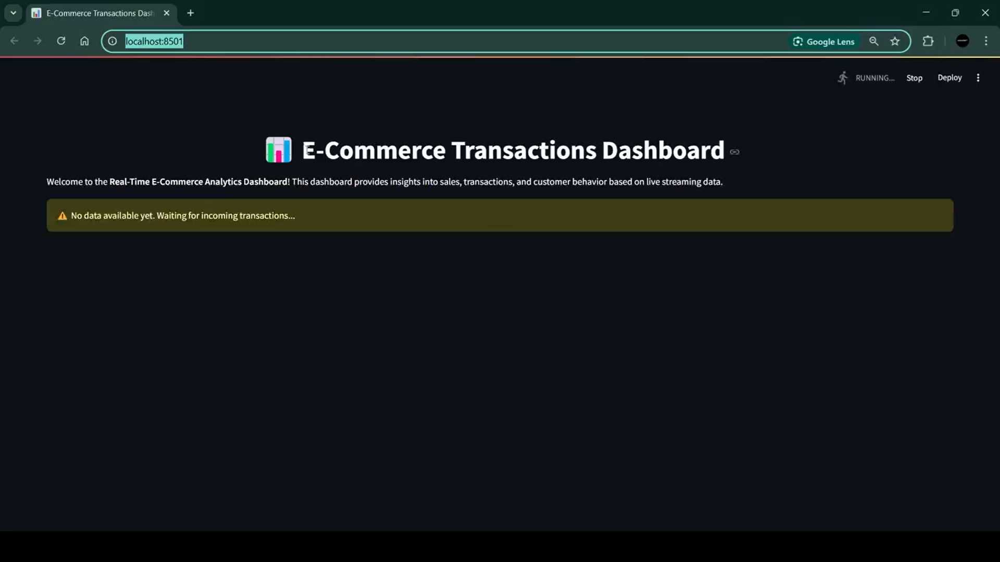
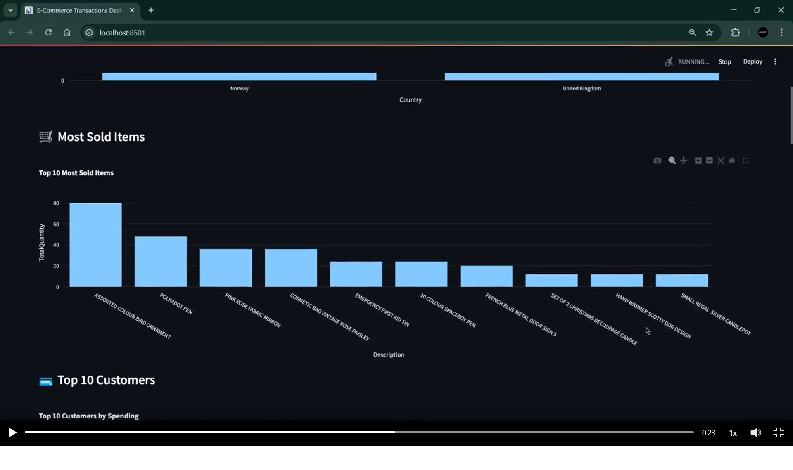

# Real-Time E-Commerce Transactions Dashboard

This project implements a real-time dashboard for monitoring e-commerce transactions using Apache Kafka, Apache Spark Structured Streaming, and Streamlit. The system processes and visualizes live transaction data in an interactive web interface.

## Features
- Real-time data streaming using **Apache Kafka**
- Stream processing with **Apache Spark**
- Interactive visualization with **Streamlit** and **Plotly**
- Dark-themed dashboard for better UI/UX

## Technologies Used
- **Apache Kafka** (for real-time messaging)
- **Apache Spark** (for structured streaming)
- **Streamlit** (for web-based visualization)
- **Plotly** (for interactive charts)
- **Pyspark** for Data handling and manipulations
- **Python** (for scripting and processing)

### Real-Time Dashboard in Action



<br><br>




<br><br>

<em>Live streaming transactions • Dark theme • Fully interactive with Plotly • Updates every few seconds</em>

</div>

## 🧭 Project Structure

```bash
atharsayed-streampulse/
├── Readme.md                   # Project documentation and setup guide
├── requirements.txt            # Python dependencies for the project
├── kafka/
│   └── producer.py             # Kafka producer that streams/simulates real-time e-commerce transactions
├── spark/
│   └── consumer.py             # Spark Structured Streaming job that reads Kafka data,
│                               # cleans/transforms it, and prepares it for dashboard consumption
└── streamlit_dashboard/
    └── dashboard.py            # Streamlit-based real-time dashboard with Plotly charts 
                                # to visualize processed e-commerce transaction insights
```

---

## Setup and Installation

### 1. Install Dependencies
Ensure Python is installed, then install the required dependencies:

```sh
pip install -r requirements.txt
```

### 2. Start Kafka Services

#### a. Start Zookeeper
```sh
.\bin\windows\zookeeper-server-start.bat .\config\zookeeper.properties
```

#### b. Start Kafka Server
```sh
.\bin\windows\kafka-server-start.bat .\config\server.properties
```

### 3. Create Kafka Topic
```sh
kafka-topics.bat --create --topic ecom-transactions --bootstrap-server localhost:9092 --partitions 1 --replication-factor 1
```

### 4. Start the Kafka Producer (Simulating Transactions)
```sh
 python .\producer.py --topic ecom-transactions --bootstrap-server localhost:9092  
```

### 5. Start the Spark Streaming Consumer
```sh
spark-submit --packages org.apache.spark:spark-sql-kafka-0-10_2.12:3.5.4 E:\DataProcessingProject\spark\consumer.py
```

### 6. Run the Streamlit Dashboard
```sh
streamlit run dashboard.py
```


